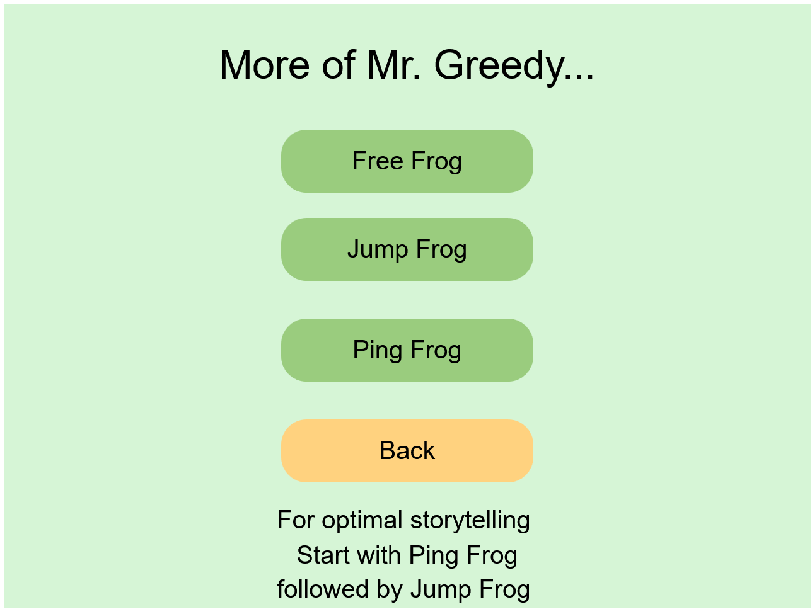
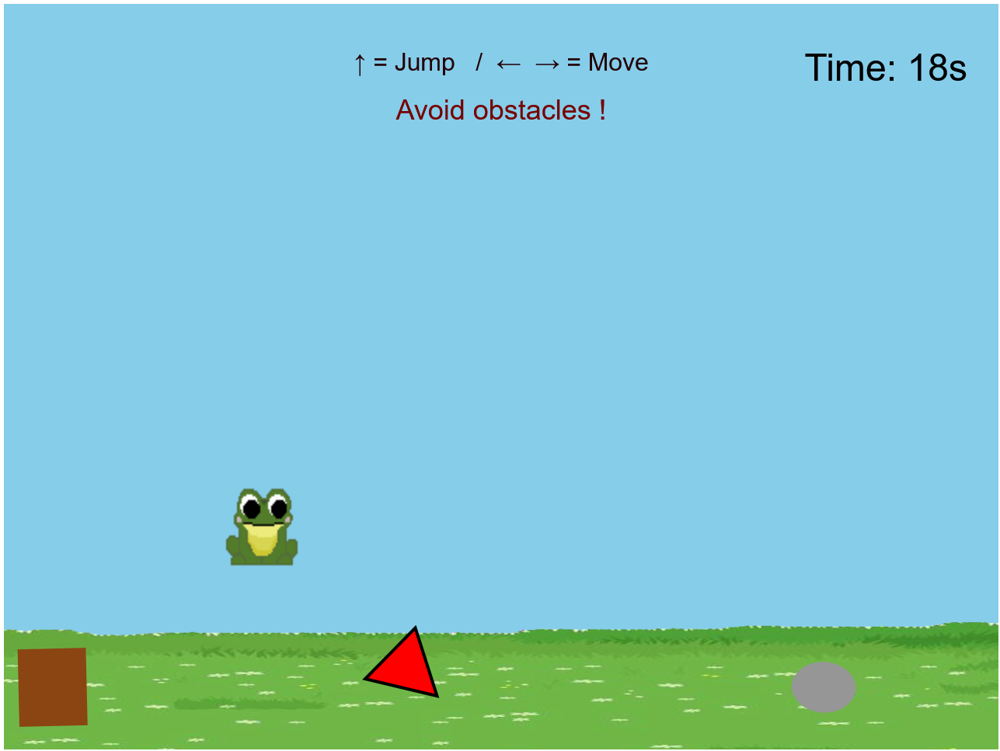
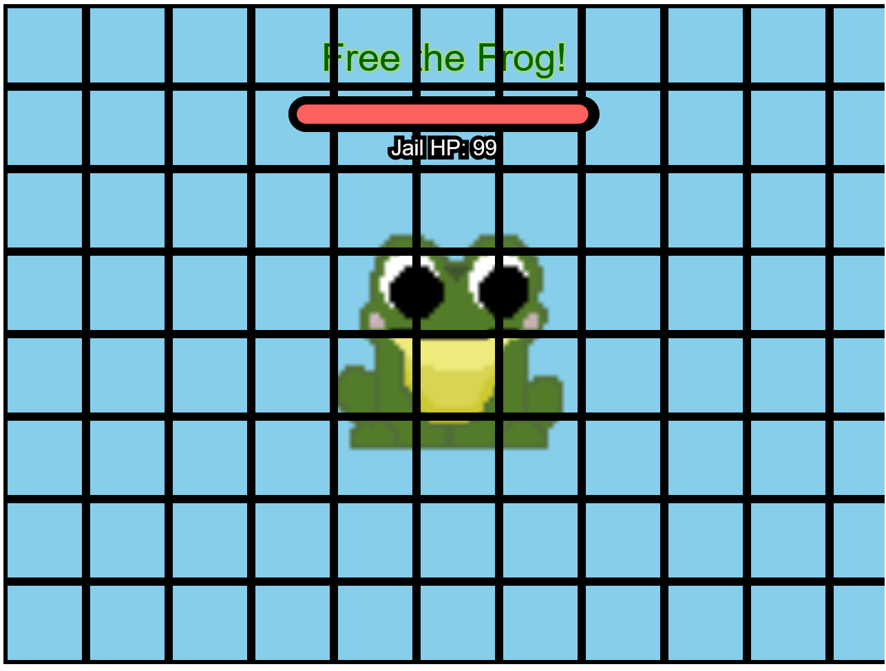

# Greedy frog

Original concept by : [Pippin Bar](https://pippinbarr.com/frogfrogfrog/)

Modded by : Jeany Corrius 

Instructions for Greedy Frog:
- Move the frog with the left right key arrows
- Press up arrow to launch the tongue
- Catch flies until you can't
- **Can you get to 3000?**

 Instructions for Ping Frog:
- Move the paddle with the up and down key arrows
- Catch flies until you can't
- **Can you get to 35 or will the AI beat you?**

  
Instructions for Free Frog:
- Move the frog with the left right key arrows
- Press up arrow to jump
- **Can you outrun your enemies?**

 Instructions for Free Frog:
- Click away

General:
- Press M to go back to the main menu
 

  

[Play it!](https://cookadle.github.io/cart253/frogfrogfrog/)

-[Ideas](./ideas.md)

## Description 
A modded version of Pippin Bar frog frog game.

Introducing Greedy Greedy frog,a silly who love eating flies any way he can!
Follow the adventures of Mr.Greedy frog in this short story made by me!

*What will happen???*
---------------------------------------------------------

## Screenshot(s)
###  Welcome to our menu!
 What will it be today?

Ah a classic *Greedy Frog...*

Oh you want **more**?

***Try beating the game ai then!***

Guess you won't stop at anything

Well if it isn't the actions of your own consequences...

## New function/attributes
- translate()
- rotate() (for obstacles movements)
- bezier
- **Known Bugs/Issues below**
- Paddle player for Ping glitching with ball sometimes
- Timer for Jump Frog not counting down smoothly

## Attribution
- Loik my partner(stolen code hihi)
- Lanna Check
- Phillipe Beauchemin

-Ai(ish)configuration + Ping Pong:
- https://gamedev.stackexchange.com/questions/124037/how-to-make-pong-ai-paddle
- https://peerdh.com/blogs/programming-insights/creating-a-simple-game-ai-using-javascript
- https://editor.p5js.org/bardyl/sketches/Tut4pb0zj
- https://stackoverflow.com/questions/69834133/how-can-i-change-an-objects-speed-in-p5-js-if-the-mouse-is-pressed-in-oop
- https://p5js.org/examples/games-ping-pong/

-Perlin noise: 
- https://thecodingtrain.com/tracks/noise/noc/perlin/intro-to-perlin-noise (Very great youtuber when it comes to learning new function on js p5)

-Title gradiant:
- https://p5js.org/examples/repetition-color-interpolation/

-Jump Frog:
- General idea/code/concept :https://editor.p5js.org/mlg583/sketches/d5q1UExau (didnt use millis cause im not comfortable yet i guess)
- Timer : https://editor.p5js.org/marynotari/sketches/S1T2ZTMp-

-Pixel Art Frog: Cookadle (me)

- Inspiration for organisation of files 
- https://github.com/Dajuuu/2D-Platformer-p5

-Clicker game ressources:(structure+code was taken )
- https://editor.p5js.org/coowill/sketches/60UssVO9L
- https://editor.p5js.org/Mortak/sketches/uBjPns_Ft

-Sounds: (Soon to be implemented)

-Title : 
- https://pixabay.com/sound-effects/nature-sounds-splashing-water-birds-singing-frog-croak-brook-108620/

-In Game:
- https://pixabay.com/music/video-games-sinnesl%c3%b6schen-beam-117362/

-Gulp:
- https://pixabay.com/sound-effects/gulp-48452/

## License

> This project is licensed under a Creative Commons Attribution ([CC BY 4.0](https://creativecommons.org/licenses/by/4.0/deed.en)) license with the exception of libraries and other components with their own licenses.

 

